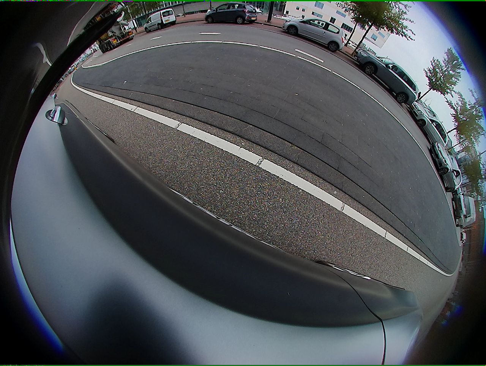
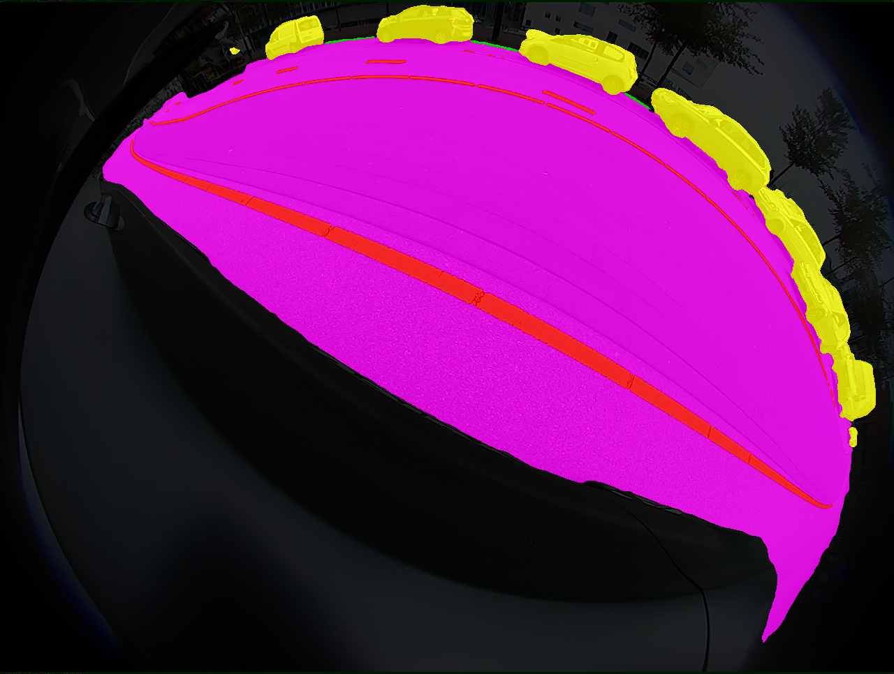

<div align=center>
  
  # Fisheye Image Segmentation with Adaptive Sampling and Edge Enhancement

</div>

## Install

Open the folder **your_env** using **Linux Terminal** and create python environment:
```
conda create -n your_env python=3.8
conda activate your_env
pip3 install torch torchvision torchaudio --index-url https://download.pytorch.org/whl/cu118
pip install -r GeoSeg/requirements.txt
```

Install Mamba
```
pip install causal-conv1d>=1.4.0
pip install mamba-ssm
```

## WoodScape

Download this dataset from the following link/location:https://woodscape.valeo.com/woodscape/

Dataset splitting: Randomly select 1000 images from WoodScape as the validation set, with the remaining images used as the training set.

## Pretrained Weights of Backbones

[Google Drive](https://drive.google.com/drive/folders/1ELpFKONJZbXmwB5WCXG7w42eHtrXzyPn?usp=sharing)


## Training

"-c" means the path of the config, use different **config** to train different models.

```
python /root/GeoSeg/train_supervision.py -c /root/GeoSeg/config/woodscape/dcswin.py
```

## Testing

"-c" denotes the path of the config, Use different **config** to test different models. 

"-o" denotes the output path 

"-t" denotes the test time augmentation (TTA), can be [None, 'lr', 'd4'], default is None, 'lr' is flip TTA, 'd4' is multiscale TTA

"--rgb" denotes whether to output masks in RGB format

```
python GeoSeg/model_test.py -c GeoSeg/config/woodscape/dcswin.py -o fig_results/woodscape_test/dcswin --rgb -t 'lr'
```

#### Segmentation reslut in woodscape dataset：
<div>


</div>

